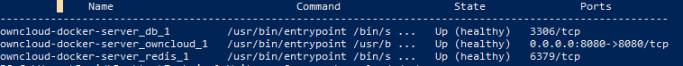

# Install and configure an ownCloud server:
## Option 1 - Install with Docker
---------------------------------------------
###  System Requirements

| Platform      | Options |
| ------------- | ------- |
| Docker Engine | 1.12.0+ |

### Installation
Install and configure an ownCloud server in 4 easy steps using Docker.

#### 1. Create and change project directory
```
mkdir owncloud-docker-server
```
```
cd owncloud-docker-server
```

#### 2. Copy docker-compose.yml from the GitHub repository
**Mac and Linux:**
```
wget https://raw.githubusercontent.com/owncloud/docs/master/modules/admin_manual/examples/installation/docker/docker-compose.yml
```
**Windows (PowerShell):**
```
wget https://raw.githubusercontent.com/owncloud/docs/master/modules/admin_manual/examples/installation/docker/docker-compose.yml -OutFile docker-compose.yml
```

#### 3. Create the environment configuration file
Next create a **.env** configuration file, which contains the required configuration settings.

Sample .env contents
```
OWNCLOUD_VERSION=10.0
OWNCLOUD_DOMAIN=localhost
ADMIN_USERNAME=admin
ADMIN_PASSWORD=admin
HTTP_PORT=8080
```
Configuration setting descriptions

| **Setting Name** | **Description**           | **Example** |
| ---------------- | ------------------------- | ----------- |
| OWNCLOUD_VERSION | The ownCloud version      | latest      |
| OWNCLOUD_DOMAIN  | The ownCloud domain       | localhost   |
| ADMIN_USERNAME   | The admin username        | admin       |
| ADMIN_PASSWORD   | The admin user’s password | admin       |
| HTTP_PORT        | The HTTP port to bind to  | 8080        |

#### 4. Build and start the container
```
docker-compose up -d
```

### Verify Installation
When the process completes, check all the containers have successfully started by running `docker-compose ps`. If the containers are all working correctly, you should expect to see output similar to what is below:



In the image you can see that the database, ownCloud, and Redis containers are running and that ownCloud is accessible via port 8080 on the host machine.

It can take a few minutes for ownCloud to be fully functional even when all containers are running. You can run `docker-compose logs --follow owncloud` to see if there are significant amounts of information logging to the console, if there is then wait for this to slow down before attempting access to the web UI.

## Option 2 - Install with OpenShift
---------------------------------------------
###  System Requirements

| Platform  | Options |
| --------- | ------- |
| OpenShift | 3.x     |

### Installation
Install and configure an ownCloud server in OpenShift 3. This guide assumes you already have an OpenShift cluster. If not, look at the [OpenShift installation documentation](https://docs.openshift.com/container-platform/3.11/getting_started/install_openshift.html).

#### 1. Log in to OpenShift with administrator access
```
oc login <cluster host> -u <admin username> -p <admin password>
```

#### 2. Apply ownCloud template to cluster
```
oc apply -n openshift -f https://raw.githubusercontent.com/owncloud-docker/openshift/master/persistent.json
```

#### 3. Open and log in to your OpenShift web UI

#### 4. Select ownCloud (Persistent) 


#### 5. Click next on setup wizard

#### 6. Enter configuration settings
* Enter OpenShift **Project Name**.
* Enter **ownCloud Domain**.
* Change **ownCloud Volume Capacity** to required capacity.
* Change the **ownCloud Admin Username and Password**.
* Click the **Create** button.


#### 6. Close configuration wizard


### Verify Installation
Open the new OpenShift project name you specified in the setup wizard, it can take a few minutes for the pods to start up. If the pods are running, you should expect to see output similar to what is below:

