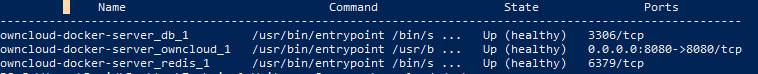

# Quickstart guide for installing and using ownCloud
## Install with Docker
###  System Requirements

| Platform | Options |
| -------------- | -------- |
| Docker Engine          | 1.12.0+    |

### Installation
The following quickstart guide allows you to install and configure an ownCloud server in 4 easy steps using Docker.

##### 1. Create and change project directory
```
mkdir owncloud-docker-server
```
```
cd owncloud-docker-server
```

##### 2. Copy docker-compose.yml from the GitHub repository

**Mac and Linux:**

```
wget https://raw.githubusercontent.com/owncloud/docs/master/modules/admin_manual/examples/installation/docker/docker-compose.yml
```

**Windows (PowerShell):**

```
wget https://raw.githubusercontent.com/owncloud/docs/master/modules/admin_manual/examples/installation/docker/docker-compose.yml -OutFile docker-compose.yml
```


##### 3. Create the environment configuration file
Next create a **.env** configuration file, which contains the required configuration settings.

Sample .env contents
```
OWNCLOUD_VERSION=10.0
OWNCLOUD_DOMAIN=localhost
ADMIN_USERNAME=admin
ADMIN_PASSWORD=admin
HTTP_PORT=8080
```
Configuration setting descriptions

| **Setting Name** | **Description**               | **Example** |
| ---------------- | ----------------------------- | ----------- |
| OWNCLOUD_VERSION | The ownCloud version      | latest      |
| OWNCLOUD_DOMAIN  | The ownCloud domain       | localhost   |
| ADMIN_USERNAME   | The admin username        | admin       |
| ADMIN_PASSWORD   | The admin user’s password | admin       |
| HTTP_PORT        | The HTTP port to bind to  | 8080        |


##### 4. Build and start the container
```
docker-compose up -d
```

### Verify Installation
When the process completes, check all the containers have successfully started, by running `docker-compose ps` If the containers are all working correctly, you should expect to see output similar to what is below:



In the image you can see that the Database, ownCloud, and Redis containers are running, and that ownCloud is accessible via port 8080 on the host machine.

It can take a few minutes for ownCloud to be fully functional even when all containers are running. you can run `docker-compose logs --follow owncloud` to see if there are significant amounts of information logging to the console, if there is then wait for this to slow down before attempting access to the web UI.


## Install with OpenShift
###  System Requirements

| Platform | Options |
| -------------- | -------- |
| OpenShift          | 3.x+    |

### Installation
The following quickstart guide allows you to install and configure an ownCloud server in OpenShift 3. This guide assumes you already have a running OpenShift cluster. If not, look at how to [install ownCloud with Docker](TODO) or the [OpenShift installation documentation](https://docs.openshift.com/container-platform/3.11/getting_started/install_openshift.html).

##### 1. Log in to OpenShift with administrator access
```
oc login <cluster host> -u <admin username> -p <admin password>
```

##### 2. Apply ownCloud template to cluster
```
oc apply -n openshift -f https://raw.githubusercontent.com/owncloud-docker/openshift/master/persistent.json
```

##### 3. Open and log in your OpenShift web console


## How to create a new user account as an administrator:

##### 1. Log into your ownCloud server web interface as an administrator

##### 2. Navigate to the users section
Once successfully logged in you will see a page like the image below, the red arrow in the image indicates the button with your username that you must click to give you options for creating a new user.


##### 3. Create a new user
* Enter the new user's **Login Name** and their **E-Mail**
* Assign **group** membership (optional)
* Click the **Create** button 


*Login names may contain letters (a-z, A-Z), numbers (0-9), dashes (-), underscores (_), periods (.) and at signs (@).*

##### 4. Set password and change users full name
You will now see your newly created user, from this pane you can set a **password** and change the users full name or leave it for the user to complete.


## How do I connect to the ownCloud server using a desktop or mobile client?

##### 1. Download and install the ownCloud Desktop Client
* Download the Desktop Client for your operating system https://owncloud.org/download/#owncloud-desktop-client
* Install using the ownCloud setup wizard

##### 2. Launch ownCloud Desktop Client connection wizard
If launching for the first time, the ownCloud connection wizard should load. If it does not, left-click the ownCloud systray icon.

##### 3. Enter ownCloud server address
Acquire the server address from your ownCloud administrator

TODO - screenshot

##### 4. Log in using your supplied username and password
If you are unsure of your username and password, please contact your ownCloud administrator.

TODO - screenshot

##### 5. Choose synchronisation settings

TODO - screenshot


